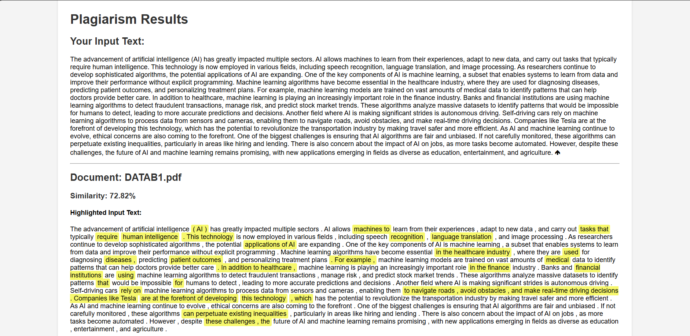

# Plagiarism Detection Tool

[](https://opensource.org/licenses/MIT)

This Python application allows users to upload a document (PDF or DOCX) and check it against a set of existing documents in a database for plagiarism. 

## Table of Contents

- [Features](#features)
- [How It Works](#how-it-works)
- [Getting Started](#getting-started)
  - [Prerequisites](#prerequisites)
  - [Installation](#installation)
  - [Usage](#usage)
- [Contributing](#contributing)
- [License](#license)

## Features

- Supports plagiarism detection in PDF and DOCX files.
- Highlights similar text segments in both the uploaded document and the database documents. 
- Provides a similarity score to indicate the level of potential plagiarism.
- Easy-to-use web interface built with Flask.

## How It Works

1. **Text Extraction:** The application extracts text content from the uploaded document and each document in the database.
2. **Text Processing:** The extracted text is tokenized into sentences.
3. **Similarity Calculation:** The TF-IDF (Term Frequency-Inverse Document Frequency) technique is used to create numerical representations of the sentences. Cosine similarity is then calculated to determine the similarity between the uploaded document and each database document.
4. **Sentence Matching and Highlighting:** `SequenceMatcher` from the `difflib` library is used to identify matching sentences between the documents. The matching sentences are highlighted in both the input text and the database text to provide a clear visualization of the plagiarism.

## Getting Started

### Prerequisites

- Python 3.6 or higher
- pip (Python package installer)

### Installation

1. Clone the repository:
   ```
   git clone https://github.com/CodeXSwaraj/plagiarism-detection-tool.git
   ```
2. Navigate to the project directory:
   ```
   cd plagiarism-detector
   ```
3. Create and activate a virtual environment (recommended):
   ```
   python -m venv env
   source env/bin/activate  # On Windows: env\Scripts\activate
   ```
4. Install the required packages:
   ```
   pip install -r requirements.txt
   ```

### Usage

1. Add Database Documents: Place the PDF or DOCX files you want to use as your database in the database folder.

2. Run the Flask application:
   ```
   flask run
   ```
3. Access the application at `http://127.0.0.1:5000/` in your web browser.

4. Upload a document to check for plagiarism.

5. View the results, which include similarity scores and highlighted matching text.

## Contributing

Contributions are welcome! Please open an issue or submit a pull request if you have any suggestions or improvements.

## License

This project is licensed under the MIT License - see the LICENSE file for details.

## Example Output

